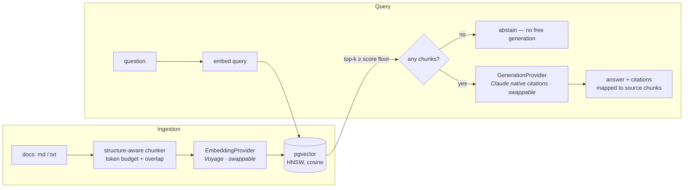

# RAG Knowledge-Store Chat

Point it at a folder of documents and ask questions in plain language — it answers **only from those documents, with citations to the exact source passages**, and says *"I don't have that information in the corpus"* rather than guess. Built as production AI infrastructure, not a demo: swappable providers, a quantitative retrieval eval gate, structured logging, one-command run.

**Stack:** NestJS/TypeScript · Postgres + pgvector (HNSW) · Voyage embeddings · Claude (`claude-opus-4-8`) with native citations · Docker Compose. No RAG framework — a thin, owned pipeline.

## Quick start

```bash
cp .env.example .env          # add VOYAGE_API_KEY + ANTHROPIC_API_KEY
docker compose up --build
curl -s localhost:3000/healthz   # {"status":"ok","db":true,"pgvector":true}
```

Schema (including the `vector` extension) is applied automatically on first start.

```bash
npm install && npm run build                # once, for the CLI
npx rag ingest ./docs                       # chunk → embed → store (idempotent)
npx rag query "How is retrieval scored?"    # cited answer in the terminal
```

Same pipeline over HTTP: `POST /ingest {path}` · `POST /query {question}`.

## Architecture



Two entrypoints (HTTP API, CLI) and the eval harness all drive the **same services in-process** — no duplicated pipeline logic.

## Key design decisions

- **pgvector over Pinecone/Qdrant** — at 1–10M vectors a dedicated vector DB buys nothing but an extra service to operate; Postgres gives transactional upserts, SQL tooling, and one `docker compose` service. The `VectorStore` interface keeps the exit door open.
- **Native Claude citations, never prompt-engineered ones** — citations come from the model's citation API with spans mapped back to source chunks. Providers without native support (an OpenAI-compatible/local adapter is included) report `citationsSupported: false` and return none: **a fabricated citation is worse than an absent one.**
- **Abstain is enforced policy, not a prompt suggestion** — if nothing clears the similarity floor, the model is never called. The floor (0.3) was calibrated from measured in-corpus vs. out-of-corpus score distributions, not vibes (`eval/probe-scores.ts`).
- **Swappable adapters at every model boundary** — `EmbeddingProvider`, `VectorStore`, `GenerationProvider`; each has two implementations or a documented seam. The same DI tokens double as integration-test seams.
- **No LangChain/LlamaIndex** — the whole pipeline is ~10 small files you can read; every retrieval knob is tunable against the eval harness.

## Retrieval quality — the eval gate

```bash
npm run eval        # exits non-zero below hit-rate / abstain-rate floors (CI-usable)
```

Baseline (`eval/dataset.jsonl`: 10 answerable + 6 should-abstain questions, `voyage-4-lite`, `MIN_SCORE=0.3`):

| Metric | Score |
|--------|-------|
| Hit-rate | **100%** (10/10) |
| Avg precision@5 | **0.43** |
| Abstain-rate (out-of-corpus) | **67%** (4/6) |

(9 chunks, k=5 → ~0.4–0.6 is the structural precision ceiling; hit-rate is the headline at this corpus size.)

Calibrating the floor 0.2 → 0.3 moved abstain-rate 0/6 → 4/6 with hit-rate unchanged. The two remaining leaks (tech-adjacent junk scoring ≈0.35, *above* the weakest real question at 0.33) are unfixable by a global similarity floor — they stay in the eval set as documented failures for answer-level grounding to catch. Any retrieval-affecting change must ship with before/after eval numbers; a pre-commit hook enforces it.

## Configuration

Everything is env-driven — see [`.env.example`](.env.example). The interesting knobs: `EMBEDDING_PROVIDER`, `GENERATION_PROVIDER` (`anthropic` | `openai-compatible` — point the latter at Ollama/vLLM for fully-local generation), `RETRIEVAL_K`, `MIN_SCORE`, `CHUNK_TOKENS`/`OVERLAP_TOKENS`, `EVAL_MIN_HIT_RATE`/`EVAL_MIN_ABSTAIN_RATE`.

## What I'd add with more time

- **Multi-agent orchestration** — a router that decomposes multi-hop questions into sub-queries over the same retrieval substrate (deliberately out of scope this iteration; see `DESIGN_DECISIONS.md` D8).
- **Hybrid retrieval + reranker** — BM25 alongside cosine, cross-encoder rerank; the eval harness exists precisely to prove whether each is worth it.
- **Answer-level eval as CI** — LLM-as-judge for groundedness/citation accuracy (harness spec'd, gated on API budget).
- **Streaming responses, authn, and a hosted deploy** — the API is stateless and Dockerized; Fly.io/Render + managed Postgres is a one-day path.

## Docs

[`PRD.md`](PRD.md) — requirements · [`TDD.md`](TDD.md) — technical design · [`DESIGN_DECISIONS.md`](DESIGN_DECISIONS.md) — D1–D9 with tradeoffs · [`doc/LEARNINGS.md`](doc/LEARNINGS.md) — build log.
